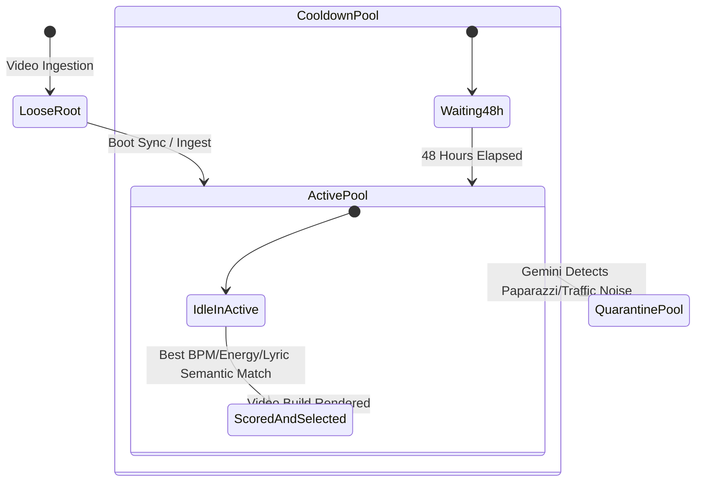

# 📄 Module Documentation: `audio_pool_manager.py`

**Rating**: `9.4 / 10 (Grade A+)`  
**Location**: `Audio_Modules/audio_pool_manager.py`  
**Target File Link**: [audio_pool_manager.py](file:///d:/simple_scrapper%20and%20_uploader/Audio_Modules/audio_pool_manager.py)

---

## 🎯 Purpose & Role

`audio_pool_manager.py` manages the complete lifecycle of extracted audio clips and background music tracks in AMTCE. 

It implements a thread-safe, 3-tier pool architecture (`active/`, `cooldown/`, and `quarantine/`) with 48-hour usage cooldown windows, atomic file operations, artifact filters, AI unusable audio detection, persistent lyric intelligence cache integration, and background Gemini AI metadata enrichment to prevent background music repetitions and noisy audio across video builds.

---

## 🏗️ Directory Architecture & Directory Pools

```
Original_audio/
├── active/               <-- Eligible audio tracks available for video builds
├── cooldown/             <-- Temporarily benched audio tracks (used within last 48 hours)
├── quarantine/           <-- Purged unusable audio (paparazzi chatter, traffic noise, trading hall shouting)
├── beats/                <-- Cached .npz binary beat grids & <filename>_lyric.json persistent intel
└── pool_metadata.json    <-- Master JSON ledger tracking usage_count, last_used, BPM, energy, is_unusable
```

---

## 💡 Key Architectural Features

### 1. 48-Hour Usage Cooldown Window
Whenever an audio track is selected for a video build:
* The file is physically moved from `active/` to `cooldown/`.
* Its `last_used` timestamp and `usage_count` increment in `pool_metadata.json`.
* Files stay in `cooldown/` for **48 hours** before being returned to `active/`, preventing repetitive music across channel uploads.

### 2. AI Unusable Audio Detection & Quarantine
During Gemini background enrichment (`_gemini_enrich_background`):
* Detects non-music noise: paparazzi shouting/chatter, car/traffic noise, stock trading hall shouting, or heavy static.
* Moves flagged files from `active/` to `Original_audio/quarantine/`.
* Hard-blocks quarantined tracks in `select_best_audio()` (`meta.get("is_unusable", False)`).

### 3. Semantic & Lyric Cache Scoring (`select_best_audio`)
When selecting the optimal BGM track:
* Reads both `pool_metadata.json` tags AND persistent `Original_audio/beats/<filename>_lyric.json` caches.
* Evaluates lyric emotion tags and vibe categories against incoming visual context categories (`content_category`).
* Dynamically rebalances scoring weights ($40\% \text{ BPM} + 20\% \text{ Energy} + 30\% \text{ Semantic Match} + 10\% \text{ Usage}$) when semantic intelligence is present.

### 4. Thread-Safe Atomic File Persistence
To prevent corrupting metadata during parallel video renders:
* All metadata writes use Python thread locks (`threading.Lock()`).
* Writes are saved to a temporary file (`pool_metadata.json.tmp`) first and swapped atomically via `os.replace()`.
* Compressed numpy beat caches (`.npz`) use atomic `tempfile.mkstemp()` writing.

### 5. Pipeline Artifact Gate (`_is_pipeline_artifact`)
Prevents intermediate rendering files from accidentally being ingested into the background music pool.

---

## 🔄 Pool Lifecycle & State Transitions


