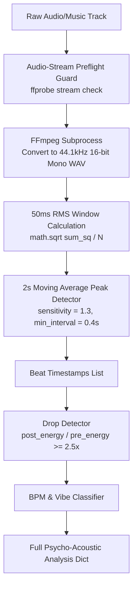

# 📄 Module Documentation: `beat_engine.py`

**Rating**: `9.5 / 10 (Grade S)`  
**Location**: `D:\AMTCE\AMTCE_Elite_Core\Audio_and_Beat_Sync\beat_engine.py`  
**Target File Link**: [beat_engine.py](file:///D:/AMTCE/AMTCE_Elite_Core/Audio_and_Beat_Sync/beat_engine.py)

---

## 🎯 Purpose & Role

`beat_engine.py` is the core zero-dependency Digital Signal Processing (DSP) beat detection engine in AMTCE. 

It decodes raw audio into PCM WAV streams, calculates 50ms Root-Mean-Square (RMS) amplitude envelopes, runs a dynamic moving-average threshold to detect onset beat timestamps, identifies explosive energy drops, estimates BPM, and classifies track vibes (`explosive`, `hype`, `groove`, `cinematic`, `ambient`).

---

## 🛠️ Key Classes & Functions

### `class BeatEngine()`

```python
# Quick Usage:
engine = BeatEngine()
beats = engine.analyze_beats("music.mp3")
# Output: [0.54, 1.23, 1.87, ...] (timestamps in seconds)

# Full Analysis with Drops & Vibe:
full_analysis = engine.analyze_beats_with_drops("music.mp3")
```

---

## 🧮 Mathematical & DSP Algorithm Breakdown

### 1. 50ms RMS Window Envelope Calculation
`beat_engine.py` groups raw 16-bit PCM integer samples into 50ms windows ($N = \text{sample\_rate} \times 0.05$) and calculates the Root-Mean-Square (RMS) amplitude:
$$\text{RMS} = \sqrt{\frac{1}{N} \sum_{i=1}^{N} s_i^2}$$

### 2. Moving Average Thresholding
Instead of a fixed volume threshold, it calculates a 2-second moving average ($20\text{ windows before} + 20\text{ windows after}$):
$$\text{Threshold} = \text{Average\_Energy}_{\text{local}} \times 1.3$$
* A beat is registered if $\text{RMS} > \text{Threshold}$ AND $\text{RMS} > 1000$ AND elapsed time since last beat $\ge 0.4\text{ seconds}$ (debounce guard).

### 3. Musical Drop Detection (`_detect_drops`)
Identifies moments where energy surges after a quiet pre-window:
$$\text{Drop Ratio} = \frac{\text{Post-Beat Energy (0.3s window)}}{\text{Pre-Beat Energy (0.6s window)}} \ge 2.5\times$$

---

## 📊 Vibe Classification Schema

`beat_engine.py` automatically categorizes track vibe based on detected BPM and energy density:

| Vibe Category | BPM Range | Target Video Edit Style |
| :--- | :---: | :--- |
| **`explosive`** | $> 140\text{ BPM}$ | Ultra-fast cuts ($2.0\text{s} - 4.0\text{s}$ shots), intense transitions. |
| **`hype`** | $120 - 140\text{ BPM}$ | High-energy short-form video pacing ($2.5\text{s} - 5.0\text{s}$ shots). |
| **`groove`** | $100 - 120\text{ BPM}$ | Smooth, rhythmic cuts ($3.0\text{s} - 6.0\text{s}$ shots). |
| **`cinematic`** | $80 - 100\text{ BPM}$ | Story-driven holds ($3.5\text{s} - 7.0\text{s}$ shots). |
| **`ambient`** | $< 80\text{ BPM}$ | Atmospheric slow cuts ($4.0\text{s} - 8.0\text{s}$ shots). |

---

## 🔄 Signal Processing Workflow


