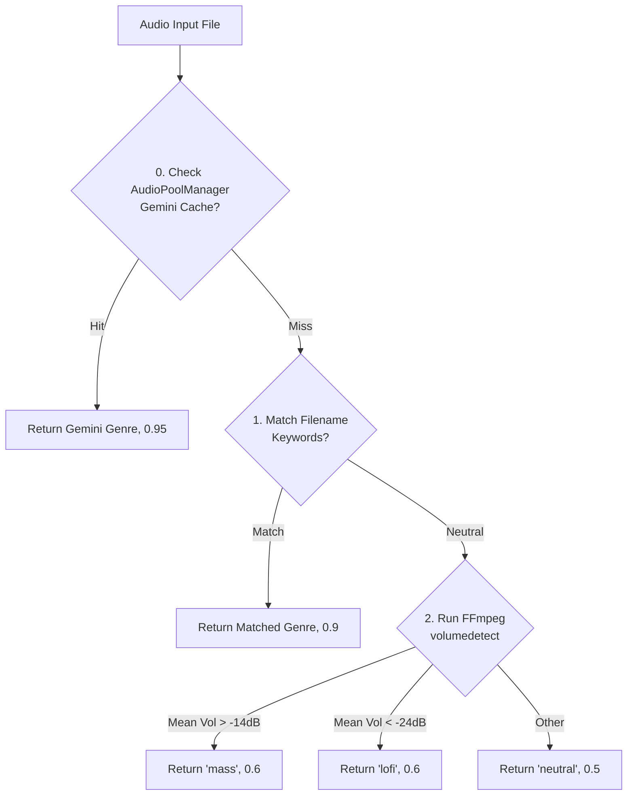

# 📄 Module Documentation: `music_intelligence.py`

**Rating**: `8.7 / 10 (Grade A)`  
**Location**: `D:\AMTCE\AMTCE_Elite_Core\Audio_and_Beat_Sync\music_intelligence.py`  
**Target File Link**: [music_intelligence.py](file:///D:/AMTCE/AMTCE_Elite_Core/Audio_and_Beat_Sync/music_intelligence.py)

---

## 🎯 Purpose & Role

`music_intelligence.py` is a fast, lightweight, heuristic-based music classifier. It classifies audio tracks into genre categories and generates FFmpeg audio filter graphs (`volumedetect`, `afade`, `volume`) to shape music audio streams during video compilation.

It operates with **zero heavy ML overhead**, utilizing a 3-tier priority fallback system (Gemini pool cache $\rightarrow$ filename keyword matching $\rightarrow$ FFmpeg volume analysis).

---

## 🛠️ Key APIs & Functions

### 1. `classify_music(file_path: str) -> Tuple[str, float]`
Analyzes an audio file and returns `(detected_genre, confidence_score)`.

#### 3-Tier Classification Priority:
* **Priority 0 (Pool Cache)**: Reads Gemini-enriched metadata from `AudioPoolManager` if available (**Confidence: 0.95**).
* **Priority 1 (Filename Keywords)**: Scans filename strings against internal keyword dictionaries (`lofi`, `mass`, `classical`, `romantic`, `pop`, `high_energy`) (**Confidence: 0.9**).
* **Priority 2 (RMS Volume Analysis)**: Uses FFmpeg `volumedetect` to measure mean volume in dB (**Confidence: 0.6**).
  * Mean volume $> -14\text{ dB} \rightarrow \text{"mass"}$ (loud/high-energy).
  * Mean volume $< -24\text{ dB} \rightarrow \text{"lofi"}$ (soft/ambient).

---

### 2. `get_filter_graph(genre: str, target_duration: float) -> str`
Generates the FFmpeg audio filter chain for background music based on genre and target video duration.

#### Genre Preset Settings:

| Genre | Fade-In Duration | Music Volume Level |
| :--- | :---: | :---: |
| **`lofi` / `romantic` / `ambient` / `classical`** | `2.0s` | `0.35` |
| **`mass` / `pop` / `hiphop` / `high_energy`** | `0.2s` | `0.55` |
| **`neutral` (Default)** | `0.5s` | `0.40` |

#### Generated FFmpeg Filter Chain String:
```ini
volume=0.40,afade=t=in:st=0:d=0.50,afade=t=out:st=14.00:d=1.00
```
* Safely clamps fade-in and fade-out durations so they never exceed `target_duration * 0.2` on short clips.

---

## 🔄 Classification Workflow


