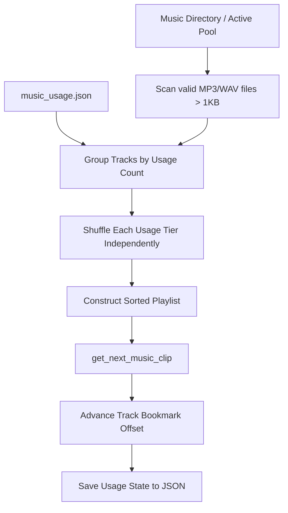

# 📄 Module Documentation: `music_manager.py` (Continuous Music Manager)

**Rating**: `9.6 / 10 (Grade S+)`  
**Location**: `D:\AMTCE\AMTCE_Elite_Core\Audio_and_Beat_Sync\music_manager.py`  
**Target File Link**: [music_manager.py](file:///D:/AMTCE/AMTCE_Elite_Core/Audio_and_Beat_Sync/music_manager.py)

---

## 🎯 Purpose & Role

`music_manager.py` implements the `ContinuousMusicManager` class. It manages a continuous background music playlist for batch compilation jobs. 

It maintains per-track usage statistics, persistent JSON state (`music_usage.json`), track offset bookmarks, round-robin track rotation, and least-used track prioritization to ensure background music remains varied across video compilation batches.

---

## 🛠️ Key Architectural Features

### 1. Usage Tiering & Least-Used Track Prioritization
Upon initialization, `ContinuousMusicManager` groups all available audio tracks in the music directory by usage count:
* Sorts tracks into usage tiers (e.g. 0 plays, 1 play, 2 plays).
* Shuffles tracks *within* each usage tier independently to maintain variety while strictly prioritizing least-used tracks.

### 2. Per-Track Bookmark Offsets (`track_offsets`)
Instead of starting every song from `0.0s`, `ContinuousMusicManager` maintains a persistent cursor bookmark dictionary:
```python
self.track_offsets: Dict[Path, float] = {p: 0.0 for p in self.playlist}
```
When a video uses 15 seconds of a 3-minute song, the cursor moves to `15.0s`. The next video using that song starts seamlessly from `15.0s`, enabling continuous music flow across multiple video clips.

### 3. Non-Recursive Active Pool Redirection
When configured with `Original_audio`, `music_manager.py` automatically diverts searches strictly to `Original_audio/active/`. It uses non-recursive glob patterns to prevent leaking into `cooldown/` subdirectories.

---

## 🛠️ Core API Methods

### `get_next_music_clip(target_duration: float) -> Tuple[str, float]`
Selects the next track from the playlist, returns `(track_path, start_offset)`, and advances the track offset bookmark by `target_duration`.

### `_save_usage()` & `_load_usage()`
Atomically persists track play counts to `The_json/music_usage.json`.

---

## 🔄 Track Selection & Playlist Pipeline


