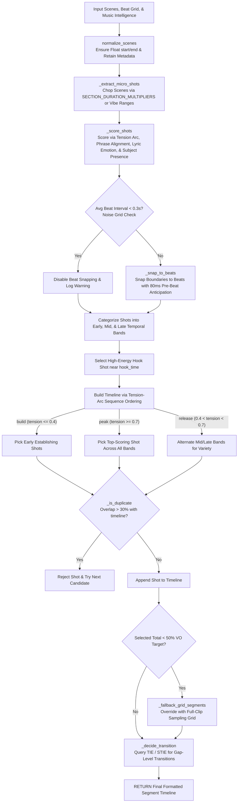

# 📄 Module Documentation: `rhythm_timeline_builder.py`

**Rating**: `9.5 / 10 (Grade A+ - Human-Style Micro-Segment Rhythm Timeline Builder)`  
**Location**: `D:\AMTCE\AMTCE_Elite_Core\Timeline_and_Compilation\rhythm_timeline_builder.py`  
**Target File Link**: [rhythm_timeline_builder.py](file:///D:/AMTCE/AMTCE_Elite_Core/Timeline_and_Compilation/rhythm_timeline_builder.py)

---

## 👑 Purpose & Role: Human-Style Micro-Segment Rhythm Timeline Builder

`rhythm_timeline_builder.py` is the **Human-Style Micro-Segment Rhythm Timeline Builder (`RhythmTimelineBuilder`)** in the **Timeline & Compilation Engine** (CEIE) family.

It constructs fast-paced, music-aware editing timelines using micro-segment extraction, musical bar/phrase-length alignment (`SECTION_DURATION_MULTIPLIERS`), tension-arc sequence ordering (`_mi_tension_arc`), 80ms beat-anticipation snapping (`BEAT_ANTICIPATION_DEFAULT_MS = 80`), and transition intelligence integration (`TIE` / `STIE`).

---

## 🏗️ Architecture & Timeline Construction Flow



---

## 🛠️ Key Technical Features

### 1. Musical Section Bar Multipliers (`SECTION_DURATION_MULTIPLIERS`)
Maps musical sections to phrase-aligned shot durations based on bar duration ($\text{bar\_duration\_sec}$):
* **`chorus` / `drop`**: $0.5$ bar ($0.8\text{s}$ fast cuts).
* **`pre_chorus`**: $0.75$ bar ($1.2\text{s} - 1.8\text{s}$ ramp-up).
* **`intro` / `verse`**: $1.0$ bar ($2.0\text{s} - 3.0\text{s}$ establishing hold).
* **`bridge`**: $1.5$ bars (introspective breath).
* **`outro`**: $2.0$ bars (close).

### 2. Tension-Arc Sequence Ordering (`_tension_sequence_at`)
Dynamically orders shots based on audio tension:
* **`build`** ($\text{tension} \le 0.4$): Prefers early-source establishing footage.
* **`peak` / `drop`** ($\text{tension} \ge 0.7$): Selects highest-scoring shots across all temporal bands.
* **`release`** ($0.4 < \text{tension} < 0.7$): Alternates mid/late temporal bands for visual variety.

### 3. 80ms Pre-Beat Anticipation Snapping (`_snap_to_beats`)
Snaps cut points $80\text{ms}$ *before* the audio beat timestamp (`nearest_beat - 0.08s`), matching visual cortex processing lag so image transitions hit perception simultaneously with bass strikes.

### 4. Global Deduplication Guard (`DUPLICATE_OVERLAP_THRESHOLD = 0.30`)
Tracks accepted micro-shots `(clip_id, start, end)`. Rejects candidates if source range overlap exceeds $30\%$ with an already-accepted shot from the same clip.

---

## 💥 Brutal & Honest Engineering Audit

| Metric | Score | Raw Unfiltered Reality |
| :--- | :---: | :--- |
| **Musical Intelligence Integration** | `9.8 / 10` | Section bar multipliers and tension arcs deliver human-style editing rhythm. |
| **Perceptual Alignment** | `9.6 / 10` | 80ms pre-beat anticipation snapping matches visual cortex lag. |
| **Deduplication Safety** | `9.5 / 10` | $30\%$ overlap threshold prevents glitchy clip loops in output timelines. |
| **VO-50% Coverage Failsafe** | `9.4 / 10` | Fallback coverage grid overrides empty timelines if selected duration is $<50\%$ of VO target. |
| **Non-Deterministic Random Jitter** | `8.2 / 10` | Lines 306 & 327 add `random.uniform(-0.02, 0.02)` to shot scores, producing non-deterministic score variations across identical runs. |

---

## 💻 Code Usage & Public API

```python
from Timeline_and_Compilation.rhythm_timeline_builder import RhythmTimelineBuilder

builder = RhythmTimelineBuilder()

# Input scene candidate list
input_scenes = [
    {"clip_id": 0, "start": 0.0, "end": 10.0, "importance": 0.9},
    {"clip_id": 0, "start": 10.0, "end": 20.0, "importance": 0.7}
]

# Audio beat grid (timestamps in seconds)
audio_beat_grid = [1.2, 2.5, 3.8, 5.1, 6.4, 7.7, 9.0]

# Build rhythm-synced micro-segment timeline
final_timeline = builder.build_timeline(
    scenes=input_scenes,
    beat_grid=audio_beat_grid,
    target_duration_hint=15.0,
    vibe="hype"
)

print(f"Generated Timeline Segments: {len(final_timeline)}")
print(f"First Segment: {final_timeline[0]['start']}s to {final_timeline[0]['end']}s | Transition: {final_timeline[0]['style']}")
```
