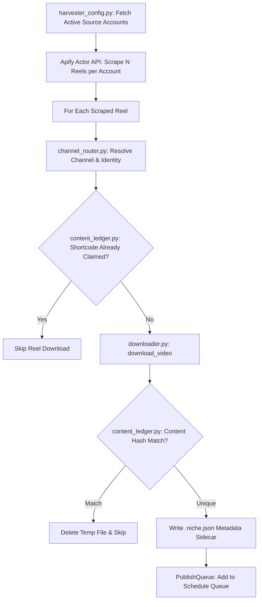

# 📄 Module Documentation: `harvester.py`

**Rating**: `9.4 / 10 (Grade A - Layer 2 Harvest & Channel Routing Engine)`  
**Location**: `D:\AMTCE\AMTCE_Elite_Core\Ingestion_and_Download\harvester.py`  
**Target File Link**: [harvester.py](file:///D:/AMTCE/AMTCE_Elite_Core/Ingestion_and_Download/harvester.py)  
**Source**: `D:\AMTCE\Content_Harvester\harvester.py` (16,319 bytes)

---

## 👑 Purpose & Role

`harvester.py` is the **Layer 2 Automated Harvest & Routing Engine (`Harvester`)** in the **Ingestion & Download** family.

It manages continuous social media reel scraping via Apify, identity resolution via `channel_router.resolve_channel()`, cross-channel deduplication via `content_ledger.py`, local clip structuring into `downloads/<actress>_NNN/`, sidecar `.niche.json` metadata injection, and publish queue enrollment.

---

## 🏗️ Architecture Flow

---

## 💥 Brutal & Honest Engineering Audit

| Metric | Score | Raw Unfiltered Reality |
| :--- | :---: | :--- |
| **Harvest Automation** | `9.5 / 10` | Automates continuous reel scraping, channel resolution, and queue enrollment. |
| **Deduplication Integration** | `9.4 / 10` | 2-stage deduplication check (shortcode pre-download + content hash post-download) saves bandwidth and storage. |
| **Metadata Injection** | `9.2 / 10` | Generates sidecar `.niche.json` files so downstream uploaders automatically know destination routing. |
