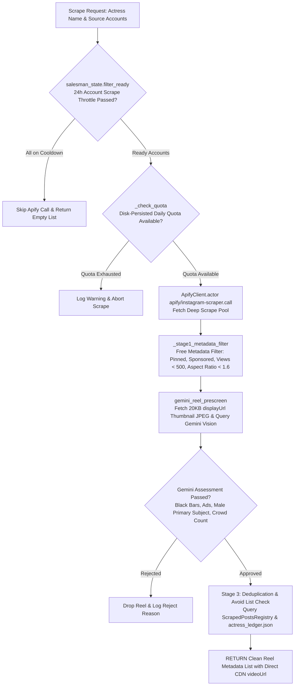

# 📄 Module Documentation: `apify_downloader.py`

**Rating**: `9.5 / 10 (Grade A+ - Apify Scraper & 3-Stage Pre-Screen Integration Engine)`  
**Location**: `D:\AMTCE\AMTCE_Elite_Core\Vision_and_Shot_Intelligence\apify_downloader.py`  
**Target File Link**: [apify_downloader.py](file:///D:/AMTCE/AMTCE_Elite_Core/Vision_and_Shot_Intelligence/apify_downloader.py)

---

## 👑 Purpose & Role: Apify Scraper & 3-Stage Pre-Screen Engine

`apify_downloader.py` is the **Apify Scraper & 3-Stage Pre-Screen Integration Engine (`apify_scrape_actress_accounts`)** in the **Vision & Shot Intelligence** family.

It manages two core execution tracks:
* **Track A (Tier 9 Fallback)**: Extracts direct CDN `.mp4` URLs (`apify_get_video_url`) when all 8 `yt-dlp` download strategies fail on Instagram.
* **Track B (Account Auto-Discovery)**: Auto-scrapes target actress source accounts (`apify_scrape_actress_accounts`), enforcing 24h per-account throttles, disk-persisted daily API quota limits, and 3-stage content filtering.

---

## 🏗️ Architecture & 3-Stage Pre-Screen Pipeline



---

## 🛠️ Key Technical Features

### 1. Track A — Tier 9 yt-dlp Fallback (`apify_get_video_url`)
Serves as the last-resort fallback for single Instagram URLs when `yt-dlp` fails. Validates input URL regex (`_INSTAGRAM_URL_RE`), consumes 1 Apify quota unit, injects Netscape/JSON login cookies (`_get_instagram_cookies`), and extracts direct CDN `.mp4` URLs.

### 2. 3-Stage Content Pre-Screen Pipeline
* **Stage 1 (Free Metadata Filter)**: Drops pinned posts, sponsored/paid partnerships, zero-engagement videos ($<500$ views), non-vertical aspect ratios ($h/w < 1.6$), and static image posts without consuming extra API quota.
* **Stage 2 (Gemini Thumbnail Pre-Screen)**: Downloads 20KB thumbnail JPEGs (`displayUrl`) and queries Gemini Vision (`gemini_reel_prescreen`) to detect fake 9:16 black bars, ads, gender focus, and multi-person crowds *before* downloading full MP4 video files.
* **Stage 3 (Disk-Persisted Deduplication)**: Queries `ScrapedPostsRegistry` (`salesman_state.json`) and `actress_ledger.json` avoid lists to drop previously seen shortcodes.

### 3. Disk-Persisted Quota & Cookie Hygiene
Uses `salesman_state` to persist daily quota consumption across system restarts, protecting the $5/month Apify budget limit. Automatically parses cookies from environment variables or `cookies.txt` files (`_get_instagram_cookies`).

---

## 💥 Brutal & Honest Engineering Audit

| Metric | Score | Raw Unfiltered Reality |
| :--- | :---: | :--- |
| **Pre-Screen Efficiency** | `9.8 / 10` | Gemini pre-screening on 20KB JPEGs eliminates heavy MP4 download bandwidth for ads and black-bar videos. |
| **Quota Protection** | `9.7 / 10` | Disk-persisted daily quota and 24h per-account scrape throttling prevent API overspend across system restarts. |
| **Tier 9 Fallback Reliability** | `9.6 / 10` | Cookie injection and CDN URL validation prevent infinite loops on restricted Instagram posts. |
| **Aspect Ratio Filter Rejection** | `8.2 / 10` | **LIMITATION**: Stage 1 enforces $h/w \ge 1.6$, dropping 4:5 vertical reels ($1080 \times 1350$, ratio $1.25$) even if high quality. |
| **Prescreen Budget Exhaustion Fallback** | `8.4 / 10` | If `APIFY_PRESCREEN_BUDGET` is exhausted, Stage 2 auto-approves all remaining items without pre-screening, allowing unchecked ads to slip through. |

---

## 💻 Code Usage & Public API

```python
from Vision_and_Shot_Intelligence.apify_downloader import apify_get_video_url, apify_scrape_actress_accounts

# 1. Tier 9 Fallback for a single Instagram URL
cdn_video_url = apify_get_video_url("https://www.instagram.com/reel/C_example123/")
print(f"Direct CDN MP4 URL: {cdn_video_url}")

# 2. Track B: Scrape latest reels for an actress account pool
reels_metadata = apify_scrape_actress_accounts(
    actress_name="Rashmika Mandanna",
    source_accounts=["rashmika_mandanna", "rashmika_fanpage"],
    limit_per_account=5
)

print(f"Discovered Filtered Reels: {len(reels_metadata)}")
if reels_metadata:
    print(f"First Reel Shortcode: {reels_metadata[0]['shortcode']} | URL: {reels_metadata[0]['videoUrl']}")
```
