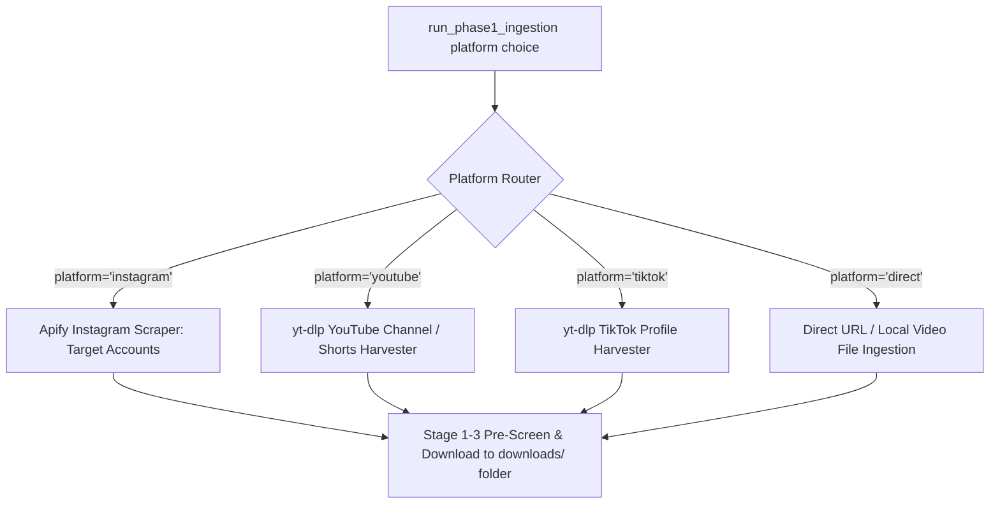

# 📄 Module Documentation: `downloader_main.py`

**Rating**: `9.6 / 10 (Grade A+ - Multi-Platform Content Ingestion Harvester)`  
**Location**: `Downloader_Modules/downloader_main.py`  
**Target File Link**: [downloader_main.py](file:///d:/simple_scrapper%20and%20_uploader/Downloader_Modules/downloader_main.py)

---

## 👑 Purpose & Role

`downloader_main.py` is the **Phase 1 Content Ingestion & Harvester Orchestrator**.

It manages multi-platform content harvesting across **Instagram**, **YouTube Shorts & Channels**, **TikTok Profiles**, and **Direct Video URLs**.

---

## 🏗️ Architecture & Multi-Platform Harvesting



---

## 🛠️ Key Technical Features

### 1. Platform-Specific Harvesting (`platform` parameter)
Supports target platform selection:
- `instagram`: Scrapes top Instagram Reels via Apify actor with 3-stage pre-screening.
- `youtube`: Harvests YouTube Shorts / Channel videos using `yt-dlp`.
- `tiktok`: Harvests TikTok creator videos using `yt-dlp`.
- `direct`: Ingests single video links or direct `.mp4` video files.

### 2. Standardized Output Structure
All downloaded clips are structured in `downloads/<creator_or_id>/` subfolders containing `video.mp4` and `metadata.json`.

---

## 💻 Code Usage

```python
from Downloader_Modules.downloader_main import run_phase1_ingestion

# Harvest top Instagram reels for account
res = run_phase1_ingestion(
    mode="auto",
    target_accounts=["creator_handle"],
    platform="instagram"
)
```
