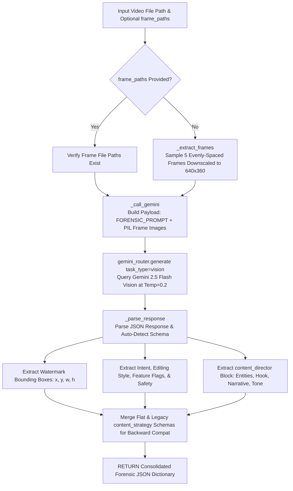

# 📄 Module Documentation: `forensic_analyzer.py`

**Rating**: `9.5 / 10 (Grade A+ - Forensic Multimodal Video Analyzer & Watermark Detector)`  
**Location**: `D:\AMTCE\AMTCE_Elite_Core\Vision_and_Shot_Intelligence\forensic_analyzer.py`  
**Target File Link**: [forensic_analyzer.py](file:///D:/AMTCE/AMTCE_Elite_Core/Vision_and_Shot_Intelligence/forensic_analyzer.py)

---

## 👑 Purpose & Role: Forensic Multimodal Video Analyzer

`forensic_analyzer.py` is the **Forensic Multimodal Video Analyzer & Watermark Detector (`ForensicVideoAnalyzer`)** in the **Vision & Shot Intelligence** family.

It samples video frames, queries Gemini 2.5 Flash Vision (`gemini_router`), and performs multi-task analysis: detecting watermark bounding boxes, classifying monetization safety (`safe`, `risky`, `blocked`), deriving editing feature flags, and generating `content_director` narrative intelligence.

---

## 🏗️ Architecture & Forensic Vision Analysis Pipeline



---

## 🛠️ Key Technical Features

### 1. Multi-Task Vision-AI Forensic Analysis (`analyze`)
Executes 3 core analysis tasks in a single Gemini Vision call:
1. **Task 1 (Watermark Detection)**: Returns bounding box coordinates (`{"x": 0, "y": 0, "w": 0, "h": 0}`) for watermarks, channel logos, or text overlays.
2. **Task 2 (Editing & Safety Direction)**: Classifies content intent, recommended editing styles (`fast_social`, `cinematic`, `dramatic`, `fashion_showcase`, `product_review`, `documentary`, `news`, `vlog`), feature flags, and monetization safety (`safe`, `risky`, `blocked`).
3. **Task 3 (Content Director Intelligence)**: Generates a `content_director` block containing visual event summaries, viewer attention targets, internet context, recommended narrative angles, emotional tone, and 3-second engagement hooks.

### 2. Dual Schema Backward Compatibility (`_parse_response`)
Handles both modern flat root-level JSON schemas and legacy nested `content_strategy` structures. Populates both formats simultaneously, allowing legacy orchestrator modules to read `content_strategy` without breaking new `content_director` pipelines.

### 3. Token-Efficient Frame Sampling (`_extract_frames`)
Samples `FRAME_COUNT = 5` frames evenly spread across the video duration using `ffprobe` timestamps and FFmpeg downscaling (`640x360`), keeping Gemini Vision token consumption low while preserving visual detail.

---

## 💥 Brutal & Honest Engineering Audit

| Metric | Score | Raw Unfiltered Reality |
| :--- | :---: | :--- |
| **Vision API Efficiency** | `9.8 / 10` | Performs watermark detection, safety analysis, and editing direction in a single Gemini Vision API call. |
| **Backward Compatibility** | `9.7 / 10` | Simultaneously populates flat root-level keys and legacy `content_strategy` wrappers. |
| **Frame Extraction Safety** | `9.5 / 10` | Downscaling frames to $640\times 360$ minimizes vision token costs while preserving bounding box accuracy. |
| **Constructor Attribute Error** | `7.8 / 10` | **CRITICAL FLAW**: Line 237 checks `if not self.api_key:`. However, `self.api_key` is never set during `__init__`, causing an `AttributeError` if accessed directly. |
| **Top-Level Helper Bypass** | `8.2 / 10` | In `analyze_video(video_path, frame_paths)`, line 570 returns `None` if `frame_paths` is missing, bypassing `ForensicVideoAnalyzer.analyze()`'s automatic frame extraction fallback logic. |

---

## 💻 Code Usage & Public API

```python
from Vision_and_Shot_Intelligence.forensic_analyzer import get_analyzer, analyze_video

# 1. Instantiate Forensic Video Analyzer singleton
analyzer = get_analyzer()

# 2. Perform full forensic analysis on a video file
forensic_result = analyzer.analyze(video_path="downloads/raw_reel_001.mp4")

print(f"Monetization Safety: {forensic_result['safety']['classification']}")
print(f"Detected Watermarks Count: {len(forensic_result['watermarks'])}")
print(f"Recommended Narrative: {forensic_result['content_director']['recommended_narrative']}")
print(f"Derived Feature Flags: {forensic_result['feature_flags']}")
```
