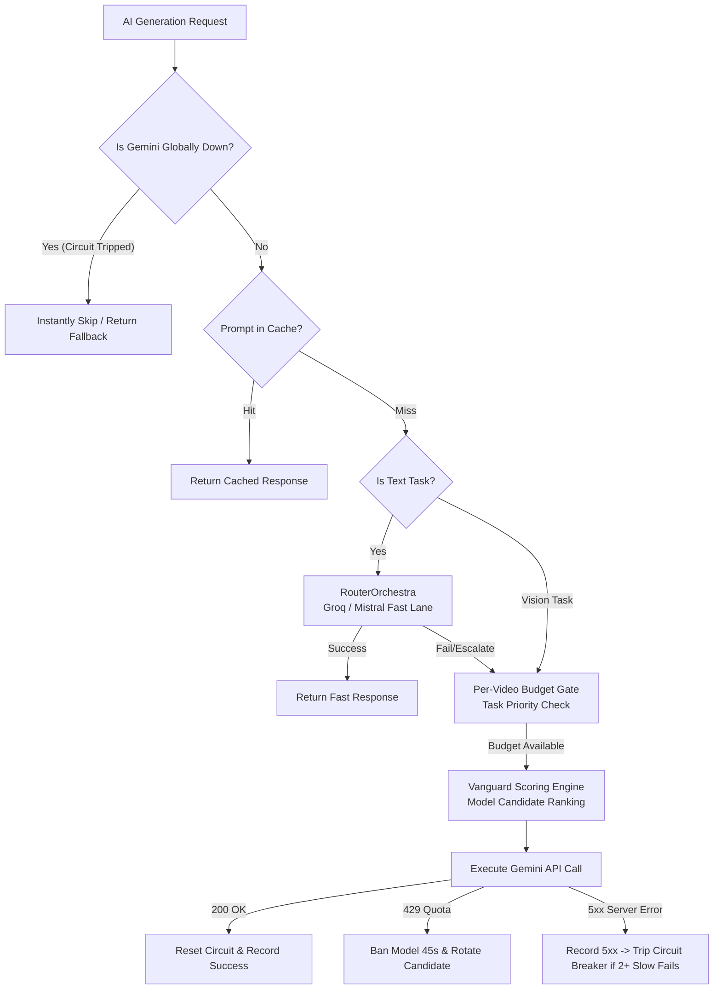

# 📄 Module Documentation: `gemini_governor.py`

**Rating**: `9.3 / 10 (Grade A)`  
**Location**: `D:\AMTCE\AMTCE_Elite_Core\Diagnostics_and_Governance\gemini_governor.py`  
**Target File Link**: [gemini_governor.py](file:///D:/AMTCE/AMTCE_Elite_Core/Diagnostics_and_Governance/gemini_governor.py)

---

## 👑 Purpose & Role: Central AI Rate Limiter, Router & Circuit Breaker

`gemini_governor.py` is the **Central AI Rate Limiter, Multi-Model Router, Cost Controller & Global Circuit Breaker (`GeminiGovernor`)** for the AMTCE system.

It prevents API rate-limit crashes (HTTP `429`), server outage stalls (HTTP `5xx`), and unnecessary token spend. It intelligently routes AI requests across Gemini models (`2.5-pro`, `2.5-flash`, `2.5-flash-lite`) and third-party fast lanes (`RouterOrchestra` / Groq / Mistral) based on task priority, model health, and per-video budget limits.

---

## 🏗️ Architecture & Execution Flow



---

## 🛠️ Key Technical Systems

### 1. Global Circuit Breaker Singleton (`is_gemini_globally_down()`)
* **Purpose**: Prevents wasting execution time during Google API server outages.
* **Trip Condition**: 2+ consecutive `5xx` server errors with latency $>3.0\text{s}$.
* **Action**: Trips circuit breaker and blocks all Gemini requests for $60\text{s} + \text{jitter}$ (random 0-5s delay to prevent burst re-alignment).

### 2. Per-Video Adaptive Budget System (`begin_video_session()`)
Adapts total AI call budget based on input clip duration:

| Clip Duration | Max Gemini Call Budget | Behaviour |
| :--- | :---: | :--- |
| **$< 15\text{s}$** | **12 Calls** | Short-form clip — minimal AI calls allowed. |
| **$< 60\text{s}$** | **18 Calls** | Standard short clip — balanced AI budget. |
| **$\ge 60\text{s}$** | **25 Calls** | Long-form video — expanded AI budget. |

* **Task Priority Tiers**: High priority tasks (`watermark`=1, `caption`=2, `narrative`=3) run first. Low priority tasks (`vision`=5, `analysis`=5) are automatically skipped when remaining budget $\le 1$.

### 3. Orchestra Fast-Lane Routing (`RouterOrchestra` Integration)
* **Text Tasks**: `reasoning`, `narrative`, `price`, `analysis`, `caption`, `master`, `creative` are automatically handed to `router_orchestra.py` (Groq/Mistral) first for zero-cost, high-speed text generation.
* **Escalation Fallback**: If third-party models fail or run out of quota, Gemini acts as the "God-Mode" fallback engine.

### 4. Vanguard Elite Weighted Model Scoring (`get_available_model()`)
Ranks available models dynamically using a multi-factor score:

$$\text{Score} = (\text{SuccessRate} \times \text{TaskBoost}) - (\text{FailCount} \times 10.0) - (\text{AvgLatency} \times 0.4)$$

* **Supported Models**: `gemini-2.5-pro`, `gemini-pro-latest`, `gemini-2.5-flash`, `gemini-2.0-flash`, `gemini-flash-latest`, `gemini-2.5-flash-lite`, `gemini-2.0-flash-lite`, plus `1.5` family (`gemini-1.5-pro`, `gemini-1.5-flash`).
* **Configurable 1.5 Filter**: 1.5 models can be optionally blocked by setting `GEMINI_BLOCK_1_5=1`.
* **Dual SDK Engine**: Compatible with both modern `google-genai` and legacy `google-generativeai`.

### 5. API Key Change Auto-Detection
* Computes a SHA-256 hash of `GEMINI_API_KEY` or `GOOGLE_API_KEY`.
* If the API key changes, `_load_states()` automatically wipes all model ban timers and 429 penalty counters.

---

## 💻 API Reference & Usage

```python
from Diagnostics_and_Governance.gemini_governor import GeminiGovernor, gemini_router

# 1. Start a video session with adaptive budget
gemini_router.begin_video_session(video_id="video_123", video_duration=13.4)

# 2. Execute an AI generation request with automatic routing & fallbacks
response_text = gemini_router.generate(
    task_type="creative",
    prompt="Generate a viral fashion caption",
    module_name="CaptionEngine"
)

# 3. Check if Gemini API is globally down
if is_gemini_globally_down():
    print("Circuit breaker active — using local fallbacks")
```
