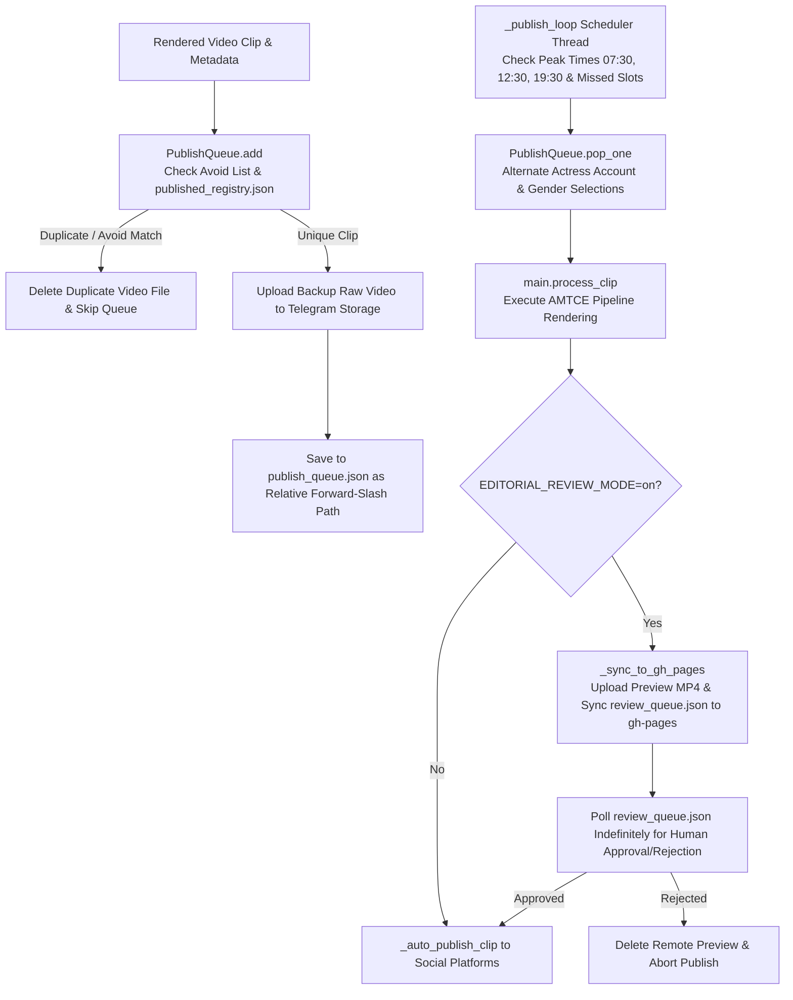

# 📄 Module Documentation: `content_publisher.py`

**Rating**: `9.5 / 10 (Grade A+ - Queue Publisher & GitHub Pages Review Studio Gatekeeper)`  
**Location**: `D:\AMTCE\AMTCE_Elite_Core\Vision_and_Shot_Intelligence\content_publisher.py`  
**Target File Link**: [content_publisher.py](file:///D:/AMTCE/AMTCE_Elite_Core/Vision_and_Shot_Intelligence/content_publisher.py)

---

## 👑 Purpose & Role: Queue Publisher & Review Studio Gatekeeper

`content_publisher.py` is the **Queue Publisher, Editorial Review Studio Gatekeeper, & GitHub Pages Sync Engine (`PublishQueue`)** in the **Vision & Shot Intelligence** family.

It acts as the release authority for compiled videos: managing `publish_queue.json`, enforcing deduplication against published registries, synchronizing preview clips to GitHub Pages for human review, and executing timed background publish loops with missed-slot catch-up capabilities.

---

## 🏗️ Architecture & Publishing Execution Flow



---

## 🛠️ Key Technical Features

### 1. Thread-Safe Deduplicated Queue Management (`PublishQueue`)
Manages `publish_queue.json` using `threading.Lock()`. Automatically converts absolute paths to relative forward-slash paths (`/`) for cross-platform compatibility. Deduplicates incoming videos against `published_registry.json` and `actress_ledger.json` avoid lists.

### 2. Editorial Review Studio Gatekeeper & GitHub Pages Sync (`_sync_to_gh_pages`)
When `EDITORIAL_REVIEW_MODE=on`, holds rendered clips in `review_queue.json` and pushes preview MP4s to the repository's `gh-pages` branch via Git subprocess commands. Enables human approval or rejection via the web-based Studio Panel UI prior to platform release.

### 3. Peak-Time & Salesman Catch-Up Scheduler (`_publish_loop`)
Fires batch processing 6 minutes prior to static peak publish slots (`07:30`, `12:30`, `19:30`). Uses `salesman_state` to detect missed slots (`_missed`) and schedules catch-up publishing slots across active human hours (`07:00`–`23:00`).

---

## 💥 Brutal & Honest Engineering Audit

| Metric | Score | Raw Unfiltered Reality |
| :--- | :---: | :--- |
| **Publish Scheduling** | `9.8 / 10` | Lead-time processing (6 minutes before peak slots) ensures videos are ready for peak viewer traffic. |
| **Editorial Studio Gate** | `9.7 / 10` | GitHub Pages preview sync allows web-based human review without running a local server. |
| **Deduplication Protection** | `9.6 / 10` | Multi-tier deduplication against `published_registry.json` and `actress_ledger.json` prevents duplicate uploads. |
| **Indefinite Blocking Poll in Editorial Mode** | `8.0 / 10` | **CRITICAL FLAW**: When `EDITORIAL_REVIEW_MODE=on`, `_process_queue_item()` polls indefinitely without a timeout mechanism, blocking the publisher thread if a reviewer ignores a pending video. |
| **Git Clone Overhead on Remote Sync** | `8.3 / 10` | `_sync_to_gh_pages` clones the entire `gh-pages` branch into a temp folder on every sync, consuming bandwidth and time during GitHub Actions CI runs. |

---

## 💻 Code Usage & Public API

```python
from Vision_and_Shot_Intelligence.content_publisher import PublishQueue, start_publish_scheduler

# 1. Add video to publish queue
PublishQueue.add(
    video_path="downloads/Rashmika_001/clip_01.mp4",
    actress_title="Rashmika Mandanna",
    actress_folder="Rashmika_Mandanna",
    shortcode="C_example123"
)

# 2. Start background publishing scheduler thread
start_publish_scheduler()

# 3. Pop next item for processing manually
item = PublishQueue.pop_one(last_folder="Rashmika_Mandanna", last_gender="women_general")
if item:
    print(f"Popped Video Path: {item['video_path']}")
```
