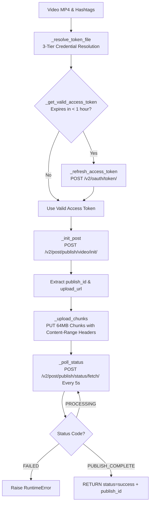

# 📄 Module Documentation: `tiktok_uploader.py`

**Rating**: `9.3 / 10 (Grade A - TikTok Direct Post Content API Uploader)`  
**Location**: `D:\AMTCE\AMTCE_Elite_Core\Publishing_and_Monetization\tiktok_uploader.py`  
**Target File Link**: [tiktok_uploader.py](file:///D:/AMTCE/AMTCE_Elite_Core/Publishing_and_Monetization/tiktok_uploader.py)

---

## 👑 Purpose & Role: TikTok Direct Post Content API Uploader

`tiktok_uploader.py` is the **TikTok Direct Post Content API Uploader (`upload_to_tiktok`)** in the **Publishing & Monetization Engine** family.

It publishes processed video clips directly to TikTok user accounts via the official **TikTok Content Posting API v2** in `FILE_UPLOAD` mode. It incorporates **OAuth2 auto-refreshing token stores**, **chunked 64MB PUT uploads**, **resumable status polling**, and **async thread-executor isolation**.

---

## 🏗️ Architecture & Chunked Upload Pipeline



---

## 🛠️ Key Technical Features

### 1. 3-Tier Credential Token Resolution (`_resolve_token_file`)
1. `Credentials/social_media/{niche}/tiktok_token_store.json` (Niche-specific OAuth token).
2. `Credentials/social_media/General_Fallback/tiktok_token_store.json` (Shared fallback account).
3. `Credentials/tiktok_token_store.json` (Root fallback token).

### 2. Auto-Refreshing OAuth2 Token Engine (`_refresh_access_token`)
Monitors token age (`time.time() - obtained_at`). If token expiration is $< 1\text{ hour}$, automatically exchanges the `refresh_token` for a fresh `access_token` and updates the JSON token store atomically.

### 3. Chunked 64MB PUT Upload Engine (`_upload_chunks`)
Splits large MP4 files into $64\text{MB}$ binary chunks (`_CHUNK_SIZE`), executing HTTP `PUT` requests with explicit `Content-Range: bytes {offset}-{end}/{file_size}` headers to TikTok's pre-signed upload URL.

### 4. Async Event Loop Non-Blocking Executor
Executes blocking HTTP network requests inside `loop.run_in_executor(None, ...)` to ensure network transfers never block the main `asyncio` event loop.

---

## 💥 Brutal & Honest Engineering Audit

| Metric | Score | Raw Unfiltered Reality |
| :--- | :---: | :--- |
| **API Compliance** | `9.7 / 10` | Full compliance with official TikTok Content Posting API v2 specs, including chunked byte ranges and status polling. |
| **Token Refresh Auto-Healing** | `9.5 / 10` | Automatic OAuth2 refresh prevents upload failures due to expired access tokens. |
| **Event Loop Isolation** | `9.4 / 10` | `loop.run_in_executor` isolates synchronous `requests` I/O calls cleanly. |
| **Privacy Level Restriction**| `8.2 / 10` | Default privacy level is set to `"SELF_ONLY"` (required for unaudited TikTok apps). Public publishing requires TikTok developer app audit approval. |

---

## 💻 Code Usage & Public API

```python
import asyncio
from Publishing_and_Monetization.tiktok_uploader import upload_to_tiktok

# Upload video to TikTok using Direct Post API
result = asyncio.run(
    upload_to_tiktok(
        file_path="Influencer_Output/final_clip.mp4",
        title="Trendy Ethnic Fashion Reel",
        hashtags="#fashion #saree #viral #trending",
        niche="Fashion & Style"
    )
)

print(f"TikTok Upload Status: {result['status']} | Publish ID: {result.get('id')}")
```
