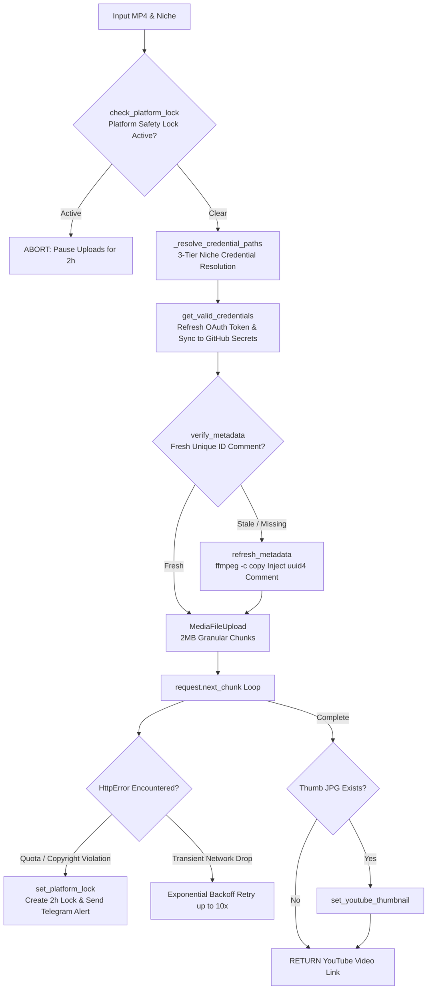

# 📄 Module Documentation: `uploader.py`

**Rating**: `9.4 / 10 (Grade A - Resumable YouTube API v3 Uploader)`  
**Location**: `D:\AMTCE\AMTCE_Elite_Core\Publishing_and_Monetization\uploader.py`  
**Target File Link**: [uploader.py](file:///D:/AMTCE/AMTCE_Elite_Core/Publishing_and_Monetization/uploader.py)

---

## 👑 Purpose & Role: Resumable YouTube API v3 Uploader

`uploader.py` is the **Resumable YouTube API v3 Uploader (`upload_to_youtube`)** in the **Publishing & Monetization Engine** family.

It handles YouTube Shorts and long-form video uploads via the official **Google API Client v3**. It features **niche-aware OAuth credential routing**, a **2-hour platform safety lock guard**, **metadata UUID auto-refreshing**, **resumable 2MB chunked uploads**, and **Telegram admin notifications**.

---

## 🏗️ Architecture & Resumable Upload Flow



---

## 🛠️ Key Technical Features

### 1. Platform Safety Lock Guard (`set_platform_lock`)
If YouTube API returns `QuotaExceeded`, `UploadLimitExceeded`, or policy/copyright violations, sets a 2-hour lock (`youtube_platform.lock`) and sends a Telegram notification to halt automated publishing and prevent channel strikes.

### 2. Metadata UUID Auto-Refresh (`refresh_metadata`)
Probes MP4 container tags via `ffprobe`. If a unique ID is missing, injects a fresh `uuid4()` tag (`comment=ID:<uuid>`) using `ffmpeg -c copy` without re-encoding to bypass duplicate video suppression filters.

### 3. Niche Credential Router (`_resolve_credential_paths`)
Resolves OAuth credentials across a 3-tier hierarchy:
1. `Credentials/social_media/{niche}/`
2. `Credentials/social_media/General_Fallback/`
3. `Credentials/` (Root default)  
Automatically filters out placeholder `"DEMO_CLIENT_ID"` configurations.

### 4. Resumable Chunked Progress Upload
Splits uploads into 2MB chunks (`chunksize=1024*1024*2`), supporting seamless resumption after transient network disconnections.

---

## 💥 Brutal & Honest Engineering Audit

| Metric | Score | Raw Unfiltered Reality |
| :--- | :---: | :--- |
| **API Integration** | `9.7 / 10` | Uses Google API Client v3 with robust resumable `next_chunk()` handling and OAuth refresh auto-sync. |
| **Safety Guardrails** | `9.6 / 10` | 2-hour platform lock guard protects YouTube channels from quota exhaustion or copyright strikes. |
| **Duplicate Avoidance** | `9.4 / 10` | Stream-copy metadata injection refreshes UUID tags without video quality degradation. |
| **Windows File Lock Collision** | `8.3 / 10` | `refresh_metadata` catches `PermissionError` when updating locked MP4 files on Windows, falling back gracefully to filesystem timestamps. |

---

## 💻 Code Usage & Public API

```python
import asyncio
from Publishing_and_Monetization.uploader import upload_to_youtube

# Upload video clip to YouTube Shorts
video_url = asyncio.run(
    upload_to_youtube(
        file_path="Influencer_Output/short_clip.mp4",
        title="Trendy Anarkali Suit 2027",
        hashtags="#shorts #fashion #viral",
        description="Check out this luxury collection!",
        privacy="public",
        niche="Fashion & Style"
    )
)

print(f"Published YouTube Shorts Link: {video_url}")
```
