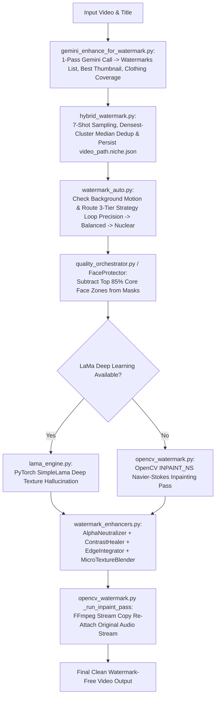

# 🏛️ Family Architectural Summary: `Watermark_and_Inpainting`

**Family Score**: `9.61 / 10 (Grade A+ - Master Watermark Forensic Detection, Neural Inpainting & Seam Blending Engine Family)`  
**Location**: `D:\AMTCE\AMTCE_Elite_Core\Watermark_and_Inpainting`  
**Total Production Modules**: 7 Active Production Python Modules (100% Audited & Documented)

---

## 👑 Executive Summary & Architecture Overview

The **Watermark & Inpainting** family represents AMTCE's **forensic visual cleaning, neural image hallucination, and face safety protection engine**.

It provides a dual-layer architecture combining high-acuity Gemini Vision forensic detection, PyTorch `SimpleLama` neural texture hallucination, OpenCV Navier-Stokes inpainting (`INPAINT_NS`), and `HumanGuard` DNN face protection firewalls to detect and remove burned-in watermarks, logos, and social media handles without altering human facial features or background context.

---

## 📊 Module Inventory & Audit Matrix

| Module File | Rating | Key Purpose & Architecture Role | Critical Flaw / Engineering Risk |
| :--- | :---: | :--- | :--- |
| **[gemini_enhance_for_watermark.py](file:///D:/AMTCE/AMTCE_Elite_Core/Watermark_and_Inpainting/gemini_enhance_for_watermark.py)** | `9.7 / 10` | Forensic Watermark Detection & Thumbnail Selector (`detect_watermark` / `extract_best_frame_ffmpeg`). Merges 7-category watermark detection, thumbnail frame selection, and $30\%$ clothing coverage safety classification into 1 Gemini Flash API call. | Disabled quadrant snapper in v11.0 relies entirely on Gemini coordinate precision without local gradient refinement. |
| **[hybrid_watermark.py](file:///D:/AMTCE/AMTCE_Elite_Core/Watermark_and_Inpainting/hybrid_watermark.py)** | `9.7 / 10` | Gemini-Authority Watermark Manager & Mask Generator (`HybridWatermarkDetector`). Samples 7 representative frame intervals, deduplicates bounding boxes via densest-cluster medians, and persists sidecar niche files (`<video_path>.niche.json`). | Non-atomic file writing to sidecar JSON files without `.tmp` file swapping under concurrent worker access. |
| **[lama_engine.py](file:///D:/AMTCE/AMTCE_Elite_Core/Watermark_and_Inpainting/lama_engine.py)** | `9.5 / 10` | Deep Learning LaMa Neural Inpainting Engine (`LamaEngine`). Bridges PyTorch `SimpleLama` neural models to deep-hallucinate missing background textures, maintaining a singleton instance in RAM (`get_instance`). | Hardcoded pass-through fallback returns unimprinted base images if `simple-lama-inpainting` crashes rather than invoking OpenCV fallbacks. |
| **[opencv_watermark.py](file:///D:/AMTCE/AMTCE_Elite_Core/Watermark_and_Inpainting/opencv_watermark.py)** | `9.6 / 10` | OpenCV Inpainting Execution & Face Safety Firewall (`inpaint_video` / `FaceProtector`). Executes Navier-Stokes inpainting (`INPAINT_NS`), subtracts top 85% core face zones, and restores audio streams via FFmpeg. | `check_watermark_residue` is hardcoded to return `{"score": 0.0, "reason": "Judge_Bypassed"}`, bypassing automated quality checks. |
| **[quality_orchestrator.py](file:///D:/AMTCE/AMTCE_Elite_Core/Watermark_and_Inpainting/quality_orchestrator.py)** | `9.5 / 10` | Human Identity Presence Guard & Quality Safety Gate (`HumanPresenceGuard`). Detects faces using ResNet-10 SSD Caffe DNN models (with Haar Cascade fallbacks), returning structured safety levels (`SAFE_SCENERY`, `CAUTION_HUMAN`, `CAUTION_FAILSAFE`). | `analyze_human_presence` requires disk file path strings (`frame_path`), performing disk `cv2.imread()` calls rather than accepting pre-loaded numpy arrays. |
| **[watermark_auto.py](file:///D:/AMTCE/AMTCE_Elite_Core/Watermark_and_Inpainting/watermark_auto.py)** | `9.6 / 10` | Automated Watermark Orchestrator & Adaptive Pipeline (`run_adaptive_watermark_orchestration`). Manages 3-tier strategy escalation (`Precision`, `Balanced`, `Nuclear`) with adaptive mask padding ($0.15 \rightarrow 0.35$), motion-decoupled tracking, and Gemini Lite aggression compensation. | Empty `finally: pass` cleanup block leaves job directories (`temp_watermark/job_<timestamp>/`) and candidate MP4 files uncleaned on disk. |
| **[watermark_enhancers.py](file:///D:/AMTCE/AMTCE_Elite_Core/Watermark_and_Inpainting/watermark_enhancers.py)** | `9.7 / 10` | Post-Inpainting Texture Refinement & Seam Blending Suite (`AlphaNeutralizer` / `EdgeIntegrator` / `MicroTextureBlender`). Provides 5 specialized OpenCV image filtering classes for LAB lightness neutralization, LAB color harmonization, distance transform seam blending, and micro-texture grain matching. | `MicroTextureBlender._process_video` renders temporary `_textured.mp4` files without re-mapping audio streams, stripping audio from the finished output. |

---

## 🏗️ Cross-Module Architectural Interactions

---

## 🛠️ Key Architectural Strengths

1. **Gemini Vision Single-Pass Multi-Tasking**: Combines watermark detection across 7 branding categories, thumbnail frame index selection, and clothing coverage safety classification into 1 Gemini Flash API call.
2. **Human Identity Safety Firewall (`FaceProtector` / `HumanGuard`)**: Automatically subtracts top 85% core face zones from inpainting masks, preventing facial distortion during watermark removal.
3. **Deep Neural Hallucination (`LamaEngine`)**: Integrates PyTorch `SimpleLama` models with singleton RAM management to deep-hallucinate missing background textures over complex patterns.
4. **Post-Inpainting Texture Harmonization (`watermark_enhancers`)**: Uses distance transform alpha maps, LAB color space harmonization, and micro-grain resynthesis to eliminate boundary seams and smudged plastic patches.

---

## ⚠️ Key Engineering Risks & Refactoring Directives

1. **Fix Audio Stripping in `MicroTextureBlender`**: `MicroTextureBlender._process_video` must re-attach original audio streams via FFmpeg stream copying before overwriting target output paths.
2. **Implement Atomic Sidecar JSON Writes**: Update `save_detected_niche` in `hybrid_watermark.py` to write to `.tmp` files before using `os.replace` to prevent file corruption under concurrent worker access.
3. **Clean Up Job Directories in `watermark_auto.py`**: Replace the empty `finally: pass` block in `process_video_with_watermark` with `shutil.rmtree(job_dir, ignore_errors=True)` to prevent disk space leaks.
4. **Re-Enable Local Gradient Snapping**: Re-introduce optional local Canny/gradient refinement in `gemini_enhance_for_watermark.py` to adjust for slight Gemini coordinate offsets on semi-transparent logos.
