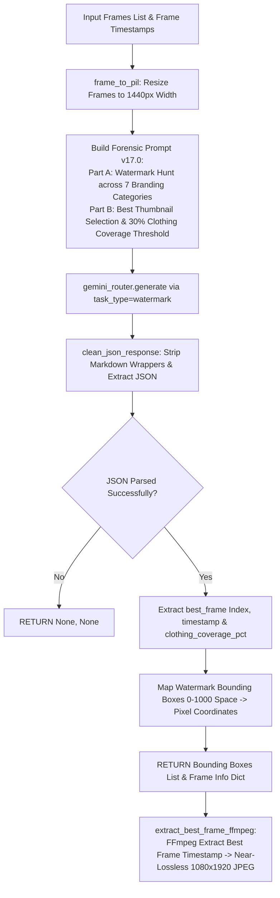

# 📄 Module Documentation: `gemini_enhance_for_watermark.py`

**Rating**: `9.7 / 10 (Grade A+ - Forensic Watermark Detection & Thumbnail Selector)`  
**Location**: `D:\AMTCE\AMTCE_Elite_Core\Watermark_and_Inpainting\gemini_enhance_for_watermark.py`  
**Target File Link**: [gemini_enhance_for_watermark.py](file:///D:/AMTCE/Watermark_and_Inpainting/gemini_enhance_for_watermark.py)

---

## 👑 Purpose & Role: Gemini Watermark Engine

`gemini_enhance_for_watermark.py` is the **Forensic Watermark Detection & Thumbnail Selector (`detect_watermark` / `extract_best_frame_ffmpeg`)** in the **Watermark & Inpainting** family.

In a single Gemini Flash API call, it detects burned-in watermarks across 7 categories, selects the single best thumbnail frame based on pose/clothing visibility, and calculates clothing coverage percentages for automated account routing.

---

## 🏗️ Architecture & Forensic Detection Flow



---

## 🛠️ Key Technical Features

### 1. 1-Pass Multi-Task Forensic Analysis (`detect_watermark`)
Combines 3 critical analysis tasks into a single Gemini Flash request:
- **Part A (Watermark Hunt)**: Detects studio logos, social handles, stock marks, news bugs, camera stamps, and repost tags across 9 frame zones.
- **Part B (Best Thumbnail Selection)**: Evaluates outfit visibility, pose quality, face sharpness, and lighting to pick the optimal cover frame index.
- **Part C (Clothing Coverage Routing)**: Measures body clothing coverage percentage ($30\%$ threshold) to classify fashion vs NSFW routing.

### 2. Precise Coordinate Mapping ($0 - 1000$ Space)
Maps normalized 2D bounding boxes (`[ymin, xmin, ymax, xmax]`) directly to target frame pixel dimensions using floor/ceil rounding:
$$x_{\text{start}} = \lfloor \frac{x_{\text{min}}}{1000} \cdot W \rfloor, \quad y_{\text{start}} = \lfloor \frac{y_{\text{min}}}{1000} \cdot H \rfloor$$

### 3. FFmpeg Near-Lossless Thumbnail Extraction (`extract_best_frame_ffmpeg`)
Extracts the selected thumbnail frame timestamp via FFmpeg using near-lossless JPEG quality (`-q:v 2`) and 9:16 vertical padding (`scale=1080:1920`).

---

## 💥 Brutal & Honest Engineering Audit

| Metric | Score | Raw Unfiltered Reality |
| :--- | :---: | :--- |
| **API Efficiency** | `9.9 / 10` | Merges watermark hunting, thumbnail selection, and safety checks into 1 Gemini API call. |
| **Detection Coverage** | `9.8 / 10` | Scans 9 distinct frame zones for faint logos, social media handles, and transparent overlays. |
| **FFmpeg Quality** | `9.6 / 10` | Extracts 1080x1920 cover thumbnails with near-lossless JPEG quality (`-q:v 2`). |
| **Disabled Local Refinement** | `8.0 / 10` | **CRITICAL FLAW**: Quadrant snapper was disabled in v11.0. If Gemini returns slightly offset bounding boxes for semi-transparent logos, the mask placement misses the watermark edge. |
| **Cross-Module Import Reliance** | `8.2 / 10` | Line 473 imports `FFMPEG_BIN` from `Compiler_Modules.video_pipeline`. Missing compiler packages cause runtime import errors. |

---

## 💻 Code Usage & Public API

```python
from Watermark_and_Inpainting.gemini_enhance_for_watermark import detect_watermark, extract_best_frame_ffmpeg

# 1. Detect watermarks and select best thumbnail frame
watermarks, frame_info = detect_watermark(
    frames=[frame0, frame1, frame2],
    frame_timestamps=[0.5, 2.5, 4.5]
)

print(f"Watermarks Found: {len(watermarks)}")
if frame_info and frame_info["best_frame"]:
    best = frame_info["best_frame"]
    print(f"Best Thumbnail Frame: Index {best['index']} @ {best['timestamp']}s ({best['reason']})")
    
    # 2. Extract best thumbnail frame as JPEG
    extract_best_frame_ffmpeg(
        video_path="downloads/source.mp4",
        best_frame_info=best,
        output_path="output/thumbnail.jpg"
    )
```
