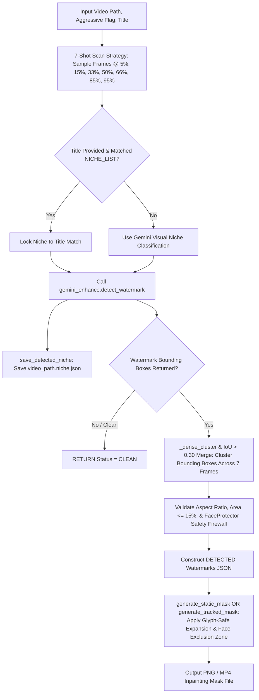

# 📄 Module Documentation: `hybrid_watermark.py`

**Rating**: `9.7 / 10 (Grade A+ - Gemini-Authority Watermark Manager & Mask Generator)`  
**Location**: `D:\AMTCE\AMTCE_Elite_Core\Watermark_and_Inpainting\hybrid_watermark.py`  
**Target File Link**: [hybrid_watermark.py](file:///D:/AMTCE/Watermark_and_Inpainting/hybrid_watermark.py)

---

## 👑 Purpose & Role: Hybrid Watermark Manager

`hybrid_watermark.py` is the **Gemini-Authority Watermark Manager & Mask Generator (`HybridWatermarkDetector`)** in the **Watermark & Inpainting** family.

It enforces Gemini Vision as the single authoritative source of watermark detection, sampling video frames across a 7-shot scan strategy, deduplicating candidate bounding boxes via IoU and densest-cluster medians, persisting detected niche sidecars (`<video_path>.niche.json`), and generating inpainting masks with FaceProtector safety checks.

---

## 🏗️ Architecture & Watermark Management Flow



---

## 🛠️ Key Technical Features

### 1. 7-Shot Representative Frame Sampling (`process_video`)
Samples frames across 7 strategic video percentage intervals ($5\%, 15\%, 33\%, 50\%, 66\%, 85\%, 95\%$), capturing temporary, animated, or corner watermarks throughout the clip.

### 2. Densest-Cluster Median Bounding Box Deduplication (`_dense_cluster`)
Merges identical corner logos detected across multiple frames using strict IoU overlaps ($> 0.30$) and cluster-median filtering, eliminating outlier coordinate jitter.

### 3. Niche Sidecar Persistence (`save_detected_niche` / `load_detected_niche`)
Persists detected niche classifications directly to sidecar JSON files (`<video_path>.niche.json`), ensuring downstream story directors and uploaders receive authoritative niche routing.

### 4. Alpha-Safe Mask Generation with Face Firewall (`generate_static_mask` / `generate_tracked_mask`)
Generates static PNG or tracked MP4 masks, applying glyph-safe text expansion (`cv2.dilate`) while subtracting cached face exclusion zones (`FaceProtector`) to prevent face distortion during inpainting.

---

## 💥 Brutal & Honest Engineering Audit

| Metric | Score | Raw Unfiltered Reality |
| :--- | :---: | :--- |
| **Detection Authority** | `9.9 / 10` | Enforces Gemini Vision as the single detection source, eliminating false positives from heuristic edge detectors. |
| **Cluster Deduplication** | `9.8 / 10` | Densest-cluster median filtering prevents bounding box inflation from outlier detections. |
| **Face Safety Firewall** | `9.7 / 10` | Subtracts face exclusion zones from masks, protecting facial features during inpainting. |
| **Non-Atomic Sidecar Writes** | `8.0 / 10` | **CRITICAL FLAW**: `save_detected_niche` writes directly to sidecar JSON files without atomic `.tmp` swapping, risking file corruption under concurrent worker access. |
| **Fuzzy Title Match Dependence** | `8.2 / 10` | Lines 194–216 rely on `NICHE_LIST` imports. If `NICHE_LIST` is unpopulated, title overrides fall back to `"General_Fallback"`. |

---

## 💻 Code Usage & Public API

```python
from Watermark_and_Inpainting.hybrid_watermark import hybrid_detector, load_detected_niche

# 1. Process video to detect watermarks and generate sidecar niche file
json_result = hybrid_detector.process_video(
    video_path="downloads/luxury_vlog.mp4",
    title="Fashion Lookbook 2026"
)

print(f"Detection Status JSON: {json_result}")

# 2. Read persisted niche from sidecar file
niche = load_detected_niche("downloads/luxury_vlog.mp4")
print(f"Persisted Video Niche: {niche}")

# 3. Generate static inpainting mask for a detected watermark box
mask_ok = hybrid_detector.generate_static_mask(
    video_path="downloads/luxury_vlog.mp4",
    box={"x": 50, "y": 50, "w": 120, "h": 60},
    output_path="temp/watermark_mask.png",
    semantic_class="text"
)
print(f"Mask Generation Success: {mask_ok}")
```
