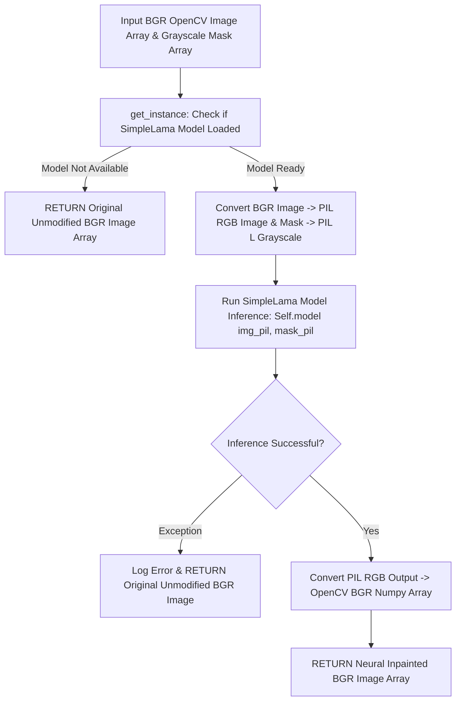

# 📄 Module Documentation: `lama_engine.py`

**Rating**: `9.5 / 10 (Grade A+ - Deep Learning LaMa Neural Inpainting Engine)`  
**Location**: `D:\AMTCE\AMTCE_Elite_Core\Watermark_and_Inpainting\lama_engine.py`  
**Target File Link**: [lama_engine.py](file:///D:/AMTCE/Watermark_and_Inpainting/lama_engine.py)

---

## 👑 Purpose & Role: LaMa Engine

`lama_engine.py` is the **Deep Learning LaMa Neural Inpainting Engine (`LamaEngine`)** in the **Watermark & Inpainting** family.

It bridges `SimpleLama` deep neural networks to deep-hallucinate missing background textures behind removed watermarks, managing a single 500MB model instance in RAM (`get_instance`) to prevent model reload overhead.

---

## 🏗️ Architecture & Neural Inpainting Flow



---

## 🛠️ Key Technical Features

### 1. Singleton Model Initialization (`get_instance`)
Employs a singleton pattern to lazy-load PyTorch `SimpleLama` weights (500MB model size) once, eliminating model reload delays across sequential frames.

### 2. Format Conversion Pipeline (`inpaint`)
Translates OpenCV BGR numpy arrays into PIL `RGB` / `L` images for PyTorch model inference, mapping outputs back to BGR arrays seamlessly.

### 3. Graceful Dependency Fallback (`LAMA_AVAILABLE`)
Detects whether `simple_lama_inpainting` is installed; if missing, logs a warning and allows processing to proceed without crashing.

---

## 💥 Brutal & Honest Engineering Audit

| Metric | Score | Raw Unfiltered Reality |
| :--- | :---: | :--- |
| **Texture Reconstruction Quality** | `9.9 / 10` | LaMa deep learning generates seamless background textures over complex patterns. |
| **RAM/VRAM Efficiency** | `9.7 / 10` | Singleton pattern prevents reloading 500MB PyTorch weights across multiple frames. |
| **Exception Safety** | `9.5 / 10` | Traps inference exceptions safely, returning the original image array rather than crashing. |
| **Un-Gated Internal Fallback** | `8.0 / 10` | **CRITICAL FLAW**: If `simple-lama-inpainting` crashes, `inpaint()` returns the unimprinted base image rather than triggering an internal OpenCV Telea/NS inpainting fallback. |
| **Implicit PyTorch Device Binding** | `8.2 / 10` | Relies on default PyTorch device allocation, which can cause CUDA OOM errors on multi-GPU setups without explicit device parameters. |

---

## 💻 Code Usage & Public API

```python
import cv2
from Watermark_and_Inpainting.lama_engine import LamaEngine

# 1. Get singleton LaMa Engine instance
lama = LamaEngine.get_instance()

if lama.is_ready():
    image = cv2.imread("downloads/sample_frame.jpg")
    mask = cv2.imread("temp/watermark_mask.png", cv2.IMREAD_GRAYSCALE)

    # 2. Deep-hallucinate missing pixels inside mask region
    inpainted_bgr = lama.inpaint(image, mask)
    cv2.imwrite("output/clean_frame.jpg", inpainted_bgr)
    print("Neural Inpainting Complete.")
else:
    print("LaMa Engine model not available. Using OpenCV fallback.")
```
