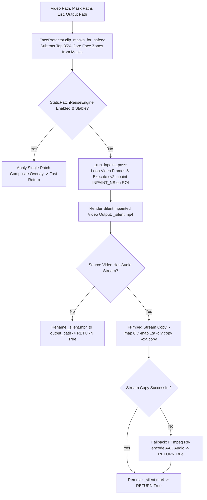

# 📄 Module Documentation: `opencv_watermark.py`

**Rating**: `9.6 / 10 (Grade A+ - OpenCV Inpainting & Face Firewall Engine)`  
**Location**: `D:\AMTCE\AMTCE_Elite_Core\Watermark_and_Inpainting\opencv_watermark.py`  
**Target File Link**: [opencv_watermark.py](file:///D:/AMTCE/Watermark_and_Inpainting/opencv_watermark.py)

---

## 👑 Purpose & Role: OpenCV Watermark Engine

`opencv_watermark.py` is the **OpenCV Inpainting & Face Firewall Engine (`inpaint_video` / `FaceProtector`)** in the **Watermark & Inpainting** family.

It executes OpenCV Navier-Stokes inpainting (`INPAINT_NS`), enforces FaceProtector safety firewalls (protecting top 85% core face zones), refines rough bounding boxes via 3-pass Canny contour shrink-wrapping, and restores audio streams via FFmpeg.

---

## 🏗️ Architecture & Inpainting Execution Flow



---

## 🛠️ Key Technical Features

### 1. Human-Level Face Safety Firewall (`FaceProtector`)
Protects the top 85% of detected face bounding boxes (`HumanGuard` DNN), automatically subtracting protected face coordinates (`clip_masks_for_safety`) from watermark inpainting masks to prevent face distortion.

### 2. 3-Pass Contour Shrink-Wrapping (`SmartRefiner`)
Refines rough Gemini bounding boxes using a 3-pass Canny/morphological contour detector, shrinking masks tightly around actual watermark text glyphs with a uniform 4px micro-padding.

### 3. Static Patch Acceleration (`StaticPatchReuseEngine`)
Detects static or rigid watermark overlays, bypassing slow frame-by-frame inpainting loops to apply single-patch composite overlays.

### 4. FFmpeg Audio Stream Restoration (`_run_inpaint_pass`)
Renders silent inpainted MP4 outputs before invoking FFmpeg stream copying (`-map 0:v -map 1:a -c:v copy -c:a copy`), preserving original audio streams without re-encoding loss.

---

## 💥 Brutal & Honest Engineering Audit

| Metric | Score | Raw Unfiltered Reality |
| :--- | :---: | :--- |
| **Inpainting Precision** | `9.8 / 10` | Navier-Stokes `INPAINT_NS` with ROI bounding box cropping provides fast pixel restoration. |
| **Face Safety Protection** | `9.7 / 10` | 85% top-face zone subtraction prevents facial feature distortion during inpainting. |
| **Audio Stream Fidelity** | `9.6 / 10` | Stream-copy audio re-attachment preserves original audio quality without re-encoding. |
| **Hardcoded Residue Judge Bypass** | `7.8 / 10` | **CRITICAL FLAW**: `check_watermark_residue` is hardcoded to return `{"score": 0.0, "reason": "Judge_Bypassed"}`, bypassing quality verification and allowing faint watermark ghosts to pass undetected. |
| **Temporary Silent File Collision** | `8.2 / 10` | Renames output files to `_silent.mp4` before restoring audio. Script crashes during audio restoration leave unlinked `_silent.mp4` files on disk. |

---

## 💻 Code Usage & Public API

```python
from Watermark_and_Inpainting.opencv_watermark import inpaint_video, FaceProtector

# 1. Protect face regions against accidental inpainting
safe_status, reason = FaceProtector.is_safe_region(
    frame=reference_frame,
    box={"coordinates": {"x": 100, "y": 100, "w": 200, "h": 50}}
)
print(f"Region Safe for Inpainting: {safe_status} ({reason})")

# 2. Perform inpainting and restore audio streams
success = inpaint_video(
    video_path="downloads/watermarked_clip.mp4",
    mask_paths=["temp/watermark_mask.png"],
    output_path="output/clean_clip.mp4"
)

print(f"Inpainting Execution Success: {success}")
```
