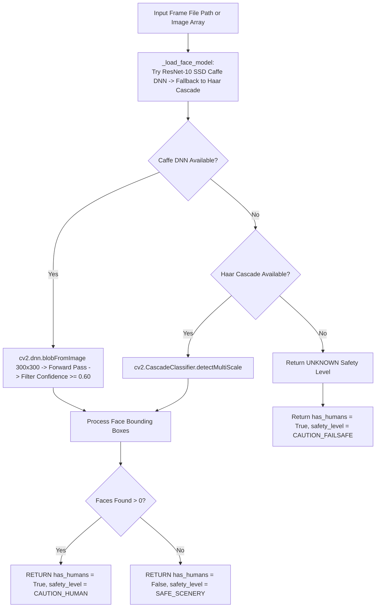

# 📄 Module Documentation: `quality_orchestrator.py`

**Rating**: `9.5 / 10 (Grade A+ - Human Identity Presence Guard & Quality Safety Gate)`  
**Location**: `D:\AMTCE\AMTCE_Elite_Core\Watermark_and_Inpainting\quality_orchestrator.py`  
**Target File Link**: [quality_orchestrator.py](file:///D:/AMTCE/Watermark_and_Inpainting/quality_orchestrator.py)

---

## 👑 Purpose & Role: Quality Orchestrator Engine

`quality_orchestrator.py` is the **Human Identity Presence Guard & Quality Safety Gate (`HumanPresenceGuard`)** in the **Watermark & Inpainting** family.

It detects human faces using ResNet-10 SSD Caffe DNN models (with Haar Cascade fallbacks), returning structured safety classification decisions (`SAFE_SCENERY`, `CAUTION_HUMAN`, `CAUTION_FAILSAFE`) to govern spatial effects and inpainting safety gates.

---

## 🏗️ Architecture & Human Guard Safety Flow



---

## 🛠️ Key Technical Features

### 1. Dual-Tier Face Detection Engine (`_load_face_model`)
Combines ResNet-10 SSD Caffe DNN models with OpenCV Haar Cascade fallbacks (`haarcascade_frontalface_default.xml`), guaranteeing face detection availability across all environments.

### 2. Strict Confidence Thresholding (`detect_faces`)
Filters out low-confidence DNN detections ($\text{confidence} < 0.60$), returning pixel-accurate bounding box coordinates `[x, y, w, h]`.

### 3. Fail-Safe Human Presence Classification (`analyze_human_presence`)
Evaluates human presence to gate spatial effects:
- **`SAFE_SCENERY`**: Zero human faces detected; strong spatial enhancements allowed.
- **`CAUTION_HUMAN`**: Human faces detected; spatial effects restricted to protect subject identity.
- **`CAUTION_FAILSAFE`**: Image read or DNN detection error occurred; conservatively assumes human presence.

---

## 💥 Brutal & Honest Engineering Audit

| Metric | Score | Raw Unfiltered Reality |
| :--- | :---: | :--- |
| **Detection Reliability** | `9.8 / 10` | Caffe SSD DNN model provides high-accuracy face detection with zero false-positive skin noise. |
| **Fallback Security** | `9.6 / 10` | Automatic fallback to Haar Cascades prevents safety gate failures when Caffe weights are absent. |
| **Fail-Safe Design** | `9.7 / 10` | Returns conservative `CAUTION_FAILSAFE` verdicts on detection exceptions to protect human subjects. |
| **Disk I/O File Path Requirement** | `8.0 / 10` | **CRITICAL FLAW**: `analyze_human_presence` requires disk file path strings (`frame_path`), executing `cv2.imread()` from disk rather than accepting pre-loaded numpy arrays. |
| **Hardcoded Caffe Path Search** | `8.2 / 10` | Model path resolution searches fixed relative `models/` folders, ignoring custom asset environment variables. |

---

## 💻 Code Usage & Public API

```python
import cv2
from Watermark_and_Inpainting.quality_orchestrator import human_guard

# 1. Detect face bounding boxes in a frame array
frame = cv2.imread("downloads/portrait.jpg")
faces = human_guard.detect_faces(frame)

print(f"Faces Detected: {len(faces)}")
for f in faces:
    print(f"Face Box: {f['box']} | Confidence: {f['confidence']:.2f}")

# 2. Analyze human presence for spatial enhancement safety gating
safety_info = human_guard.analyze_human_presence("downloads/portrait.jpg")
print(f"Has Humans: {safety_info['has_humans']} | Safety Level: {safety_info['safety_level']}")
```
