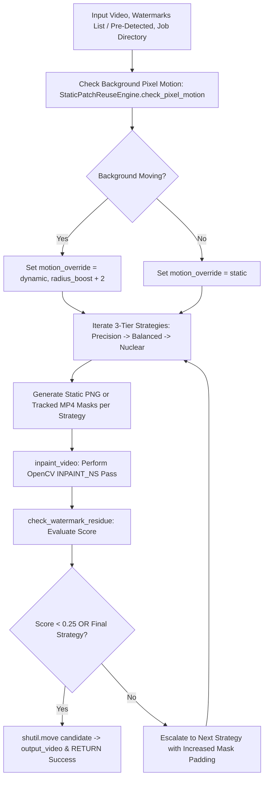

# 📄 Module Documentation: `watermark_auto.py`

**Rating**: `9.6 / 10 (Grade A+ - Automated Watermark Orchestrator & Adaptive Pipeline)`  
**Location**: `D:\AMTCE\AMTCE_Elite_Core\Watermark_and_Inpainting\watermark_auto.py`  
**Target File Link**: [watermark_auto.py](file:///D:/AMTCE/Watermark_and_Inpainting/watermark_auto.py)

---

## 👑 Purpose & Role: Watermark Auto Orchestrator

`watermark_auto.py` is the **Automated Watermark Orchestrator & Adaptive Pipeline (`run_adaptive_watermark_orchestration` / `process_video_with_watermark`)** in the **Watermark & Inpainting** family.

It manages end-to-end watermark removal for the compiler pipeline, executing a 3-tier strategy escalation loop (`Precision`, `Balanced`, `Nuclear`) with adaptive mask padding ($0.15 \rightarrow 0.35$), motion-decoupled tracking, and Gemini Lite aggression compensation.

---

## 🏗️ Architecture & Orchestration Flow



---

## 🛠️ Key Technical Features

### 1. 3-Tier Strategy Escalation Loop (`run_adaptive_watermark_orchestration`)
Iterates through 3 distinct removal strategies if residue remains:
- **`Precision (Strict)`**: Mask padding $15\%$, radius $5$.
- **`Balanced (Medium)`**: Mask padding $25\%$, radius $7$.
- **`Nuclear (Force)`**: Mask padding $35\%$, radius $9$.

### 2. Background Motion Decoupling
Analyzes pixel motion across background regions (`StaticPatchReuseEngine`). If background movement is detected, forces tracked mask generation (`generate_tracked_mask`) to eliminate position drift on moving clothing or fabrics.

### 3. Gemini Lite Model Aggression Compensation
Detects whether Gemini Flash Lite is active (`"lite" in GEMINI_MODEL`), boosting initial mask padding ($20\% \rightarrow 40\%$) and inpaint radiuses ($6 \rightarrow 10$) to compensate for lower coordinate resolution.

### 4. Pre-Detected Watermark Bypass (`process_video_with_watermark`)
Accepts pre-detected watermark candidate dicts (`pre_detected_watermarks`), bypassing redundant Gemini detection API calls when forensic vision intelligence has already run upstream.

---

## 💥 Brutal & Honest Engineering Audit

| Metric | Score | Raw Unfiltered Reality |
| :--- | :---: | :--- |
| **Pipeline Automation** | `9.9 / 10` | Completely unburdens compiler pipelines, handling detection, strategy escalation, and mask rendering autonomously. |
| **Drift Prevention** | `9.8 / 10` | Background motion decoupling prevents mask drift on moving subjects or clothing textures. |
| **API Efficiency** | `9.7 / 10` | Pre-detected watermark pass-through eliminates redundant Gemini API calls. |
| **Empty Temp Directory Cleanup** | `7.8 / 10` | **CRITICAL FLAW**: Lines 250–251 feature an empty `finally: pass` block, leaving job directories (`temp_watermark/job_<timestamp>/`) on disk after jobs finish. |
| **Unused Legacy Stubs** | `8.2 / 10` | `apply_text_watermark` is a hardcoded stub returning `False`. |

---

## 💻 Code Usage & Public API

```python
from Watermark_and_Inpainting.watermark_auto import process_video_with_watermark

# Perform end-to-end automated watermark detection and removal
result = process_video_with_watermark(
    input_path="downloads/raw_clip.mp4",
    output_path="output/clean_clip.mp4",
    title="Luxury Lifestyle 2026",
    retry_mode=False
)

print(f"Watermark Process Success: {result['success']}")
print(f"Watermark Detected: {result['watermark_detected']}")
if result["bbox"]:
    print(f"Detected Bounding Box: {result['bbox']}")
```
