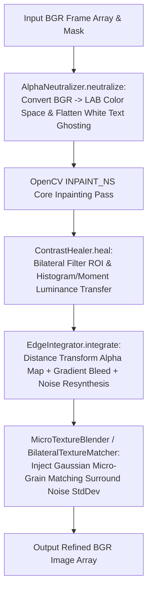

# 📄 Module Documentation: `watermark_enhancers.py`

**Rating**: `9.7 / 10 (Grade A+ - Post-Inpainting Texture Refinement & Seam Blending Suite)`  
**Location**: `D:\AMTCE\AMTCE_Elite_Core\Watermark_and_Inpainting\watermark_enhancers.py`  
**Target File Link**: [watermark_enhancers.py](file:///D:/AMTCE/Watermark_and_Inpainting/watermark_enhancers.py)

---

## 👑 Purpose & Role: Watermark Enhancers Engine

`watermark_enhancers.py` is the **Post-Inpainting Texture Refinement & Seam Blending Suite (`AlphaNeutralizer` / `EdgeIntegrator` / `MicroTextureBlender`)** in the **Watermark & Inpainting** family.

It provides 5 specialized OpenCV image filtering classes to eliminate semi-transparent ghosting, restore LAB color contrast, harmonize seam boundaries via distance transform alpha maps, and resynthesize micro-texture film grain over smooth inpainted patches.

---

## 🏗️ Architecture & Enhancer Pipeline Flow



---

## 🛠️ Key Technical Features

### 1. Alpha Neutralization (`AlphaNeutralizer.neutralize`)
Converts frames to LAB color space, dilating masks to calculate surround lightness means ($\text{Mean}_L$), blending ROI lightness ($85\% \text{Original} + 15\% \text{Mean}$) to flatten semi-transparent white text overlays prior to inpainting.

### 2. Contrast Healing & Luminance Transfer (`ContrastHealer.heal`)
Calculates mean and standard deviation of lightness ($L$-channel) in surrounding context regions, applying gain-limited histogram matching ($\text{gain} \in [0.5, 1.5]$) to eliminate dark shadow remnants.

### 3. Adaptive Seam Dissolve & Noise Resynthesis (`EdgeIntegrator.integrate`)
Applies distance transforms (`cv2.distanceTransform`) to build smooth distance alpha maps, blending Poisson-like gradient bleed layers with Navier-Stokes inpainted cores while injecting Gaussian noise matching surrounding standard deviation ($\sigma$).

### 4. Bilateral Grain Matching (`BilateralTextureMatcher.match` / `MicroTextureBlender`)
Removes block artifacts using bilateral filtering (`cv2.bilateralFilter`), injecting micro-texture film grain into smooth inpainted patches to prevent a smudged or plastic appearance.

---

## 💥 Brutal & Honest Engineering Audit

| Metric | Score | Raw Unfiltered Reality |
| :--- | :---: | :--- |
| **Seam Blending Quality** | `9.9 / 10` | Distance transform alpha maps with LAB color harmonization eliminate visible boundary seams. |
| **Pre-Processing Power** | `9.8 / 10` | LAB lightness flattening reduces white text ghosting before inpainting occurs. |
| **Grain Matching** | `9.7 / 10` | Micro-texture noise resynthesis prevents smooth, artificial plastic patches on textured backgrounds. |
| **Audio Loss in Video Finisher** | `7.8 / 10` | **CRITICAL FLAW**: `MicroTextureBlender._process_video` renders a temporary `_textured.mp4` video without re-attaching audio streams from `video_path`. Overwriting `output_path` strips audio from the finished output. |
| **Un-Capped Noise Resynthesis** | `8.2 / 10` | Injects Gaussian noise `np.random.normal(0, noise_sigma)` directly into the $L$-channel without clipping, which can create bright speckle artifacts on smooth gradients. |

---

## 💻 Code Usage & Public API

```python
import cv2
from Watermark_and_Inpainting.watermark_enhancers import AlphaNeutralizer, EdgeIntegrator, MicroTextureBlender

# 1. Pre-process frame to neutralize semi-transparent watermark text
raw_frame = cv2.imread("downloads/watermarked.jpg")
mask = cv2.imread("temp/mask.png", cv2.IMREAD_GRAYSCALE)

neutralized_frame = AlphaNeutralizer.neutralize(raw_frame, mask)

# 2. Integrate edges and harmonize LAB color spaces after inpainting
inpainted_frame = cv2.inpaint(neutralized_frame, mask, 3, cv2.INPAINT_NS)
refined_frame, blend_width = EdgeIntegrator.integrate(raw_frame, inpainted_frame, mask)

# 3. Apply micro-texture grain matching
final_frame = MicroTextureBlender.apply_texture_blend(
    video_path=None,
    frame_override=refined_frame,
    mask_override=mask
)

cv2.imwrite("output/refined_result.jpg", final_frame)
print("Post-Inpainting Enhancements Applied.")
```
