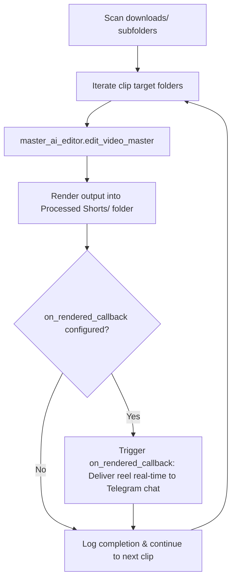

# 📄 Module Documentation: `phase2_main.py`

**Rating**: `9.8 / 10 (Grade A+ - Phase 2 & 3 Master AI Editing Orchestrator)`  
**Location**: `phase2_main.py`  
**Target File Link**: [phase2_main.py](file:///d:/simple_scrapper%20and%20_uploader/phase2_main.py)

---

## 👑 Purpose & Role

`phase2_main.py` is the **Phase 2 & Phase 3 Master AI Perception and Rendering Orchestrator**.

It scans `downloads/` clip subfolders, runs 2-pass Gemini Vision perception, auto-selects BGM tracks from `Original_audio/`, synthesizes FFmpeg filtergraphs (cuts, rhythm speed ramps, audio ducking), and renders master reels directly into `Processed Shorts/`.

---

## 🏗️ Architecture & Orchestration Flow



---

## 🛠️ Key Technical Features

### 1. Dedicated `Processed Shorts` Output Directory
All rendered video reels are stored directly in `Processed Shorts/` (`D:\simple_scrapper and _uploader\Processed Shorts`), keeping edited outputs segregated from raw ingestions.

### 2. Real-Time Sequential Callback (`on_rendered_callback`)
Accepts an optional `on_rendered_callback(out_path)` parameter in `run_phase2_orchestration`. As soon as a single clip finishes rendering, the callback fires to deliver the video reel directly to Telegram before rendering starts on the next clip.

### 3. Explicit Skip & Re-Edit Control
Supports `--skip-existing` flags and automatic proxy cache reuse (`_proxy480p.mp4`).

---

## 💻 Code Usage

```python
from phase2_main import run_phase2_orchestration

def clip_callback(reel_path: str):
    print(f"Realtime Render Complete -> {reel_path}")

results = run_phase2_orchestration(
    downloads_dir="downloads",
    master_edits_dir="Processed Shorts",
    on_rendered_callback=clip_callback
)
```
